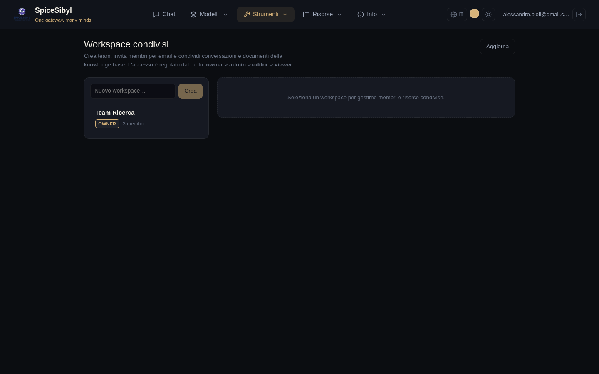

# Workspace e collaborazione

Funzionalità di team costruite sugli account della Fase 13 e sullo scoping della knowledge base della Fase 17: workspace condivisi con accesso basato sui ruoli e commenti in thread sulle conversazioni condivise.

## Workspace condivisi

**Cosa fa.** Un workspace è un contenitore di team di proprietà di un utente. Altri account vi aderiscono come **membri** con un ruolo, e il proprietario condivide singole conversazioni e documenti della knowledge base *dentro* il workspace, rendendoli visibili a tutti i membri. Le risorse mantengono il proprietario originale — la condivisione è una relazione di join (`workspace_conversations` / `workspace_documents`), non una copia — quindi annullare la condivisione rimuove semplicemente il collegamento.

**Ruoli.** Quattro livelli, in ordine decrescente di privilegio:

| Ruolo | Cosa può fare |
|-------|---------------|
| **owner** | Tutto, più rinominare/eliminare il workspace e gestire ogni membro. Ha creato il workspace; ne esiste esattamente uno per workspace. |
| **admin** | Gestire i membri (aggiungere/cambiare ruolo/rimuovere, tranne il proprietario) e condividere/rimuovere risorse. |
| **editor** | Condividere/rimuovere le proprie risorse e commentare. |
| **viewer** | Leggere le risorse condivise e commentare. |

Qualsiasi membro (anche un viewer) può **abbandonare** un workspace da solo; solo admin+ può rimuovere *altri* membri. Condividere una conversazione o un documento richiede editor+ **e** la proprietà di quella risorsa — non puoi condividere qualcosa che non è tuo.

**Come si usa.** Apri la pagina **Workspace** dalla barra di navigazione:

- La barra laterale sinistra elenca i workspace di cui fai parte (con il tuo ruolo e il numero di membri) e un campo per crearne uno nuovo — creandolo ne diventi il proprietario.
- Selezionando un workspace si apre il pannello di dettaglio con tre schede: **Membri**, **Conversazioni condivise** e **Documenti condivisi**.
- **Membri** — invita per email (l'account deve già esistere), cambia il ruolo di un membro inline oppure rimuovilo. I controlli di gestione compaiono solo per admin+; la riga del proprietario non è modificabile.
- **Conversazioni / Documenti condivisi** — scegli una tua conversazione o un tuo documento KB dal menu a tendina e condividilo; da quel momento ogni membro lo vede nell'elenco. La **✕** annulla la condivisione (editor+).

**API.**

| Metodo e path | Scopo | Ruolo minimo |
|---------------|-------|--------------|
| `GET /v1/workspaces` | Workspace di cui fa parte il chiamante | membro |
| `POST /v1/workspaces` | Crea (il chiamante diventa owner) | — |
| `PATCH /v1/workspaces/{ws}` | Rinomina | admin |
| `DELETE /v1/workspaces/{ws}` | Elimina | owner |
| `GET/POST /v1/workspaces/{ws}/members` | Elenca / invita per email | view / admin |
| `PATCH/DELETE /v1/workspaces/{ws}/members/{uid}` | Cambia ruolo / rimuovi (o auto-uscita) | admin |
| `GET/POST /v1/workspaces/{ws}/conversations` | Elenca / condividi una conversazione | view / editor |
| `DELETE /v1/workspaces/{ws}/conversations/{cid}` | Rimuovi condivisione di una conversazione | editor |
| `GET/POST /v1/workspaces/{ws}/documents` | Elenca / condividi un documento KB | view / editor |
| `DELETE /v1/workspaces/{ws}/documents/{did}` | Rimuovi condivisione di un documento KB | editor |

## Annotazioni e commenti

**Cosa fa.** Commenti in thread su una conversazione condivisa. Un commento può essere un thread di primo livello o una risposta (`parent_id`) e, facoltativamente, essere ancorato a un messaggio specifico (`message_id`). I commenti sono **eliminati in modo soft** — un commento rimosso viene svuotato e contrassegnato invece di essere cancellato, così le risposte sottostanti mantengono il loro posto nel thread.

**Chi li vede.** L'accesso rispecchia la portata della conversazione: il suo proprietario, o qualsiasi membro di un workspace in cui è stata condivisa, può leggere e scrivere. La modifica e l'eliminazione sono riservate all'**autore** del commento — nessun altro può alterare il tuo testo, indipendentemente dal ruolo nel workspace.

**Come si usa.** Nella pagina Workspace, ogni conversazione condivisa ha un pulsante **Commenti** che apre un pannello in thread sotto di essa. Scrivi un commento di primo livello nella casella, usa **Rispondi** per annidare una risposta e **Modifica / Elimina** sui tuoi commenti. I thread si annidano visivamente tramite l'indentazione.

**API** (sotto `/v1/conversations/{id}/comments`):

| Metodo e path | Scopo |
|---------------|-------|
| `GET /` | Elenca tutti i commenti della conversazione (organizzati in thread lato client tramite `parent_id`) |
| `POST /` | Aggiungi un commento (`body`, `message_id` opzionale, `parent_id` opzionale) |
| `PATCH /{comment_id}` | Modifica il tuo commento |
| `DELETE /{comment_id}` | Elimina (soft) il tuo commento |

Un chiamante senza alcuna relazione con la conversazione riceve un `404` (invece di `403`), così l'esistenza di conversazioni private non viene mai rivelata.

## Modello dati

- `workspaces` — `id`, `name`, `owner_id`, timestamp.
- `workspace_members` — `(workspace_id, user_id)` con `role`; il proprietario è memorizzato come riga membro (`role='owner'`) così le query di appartenenza sono uniformi.
- `workspace_conversations` / `workspace_documents` — tabelle di join che collegano un workspace alle conversazioni / documenti KB condivisi, con `shared_by` e `shared_at`.
- `comments` — `id`, `conversation_id`, `message_id` opzionale, `parent_id` opzionale, `user_id`, `body`, `deleted`, timestamp.

Tutte le tabelle usano il cascade in eliminazione tramite le foreign key, quindi rimuovere un workspace, una conversazione o un utente ripulisce automaticamente le righe dipendenti.

> La collaborazione in tempo reale (più utenti contemporaneamente in una conversazione via WebSocket, con indicatori di presenza) è pianificata come Fase 20.c e non è ancora implementata.
